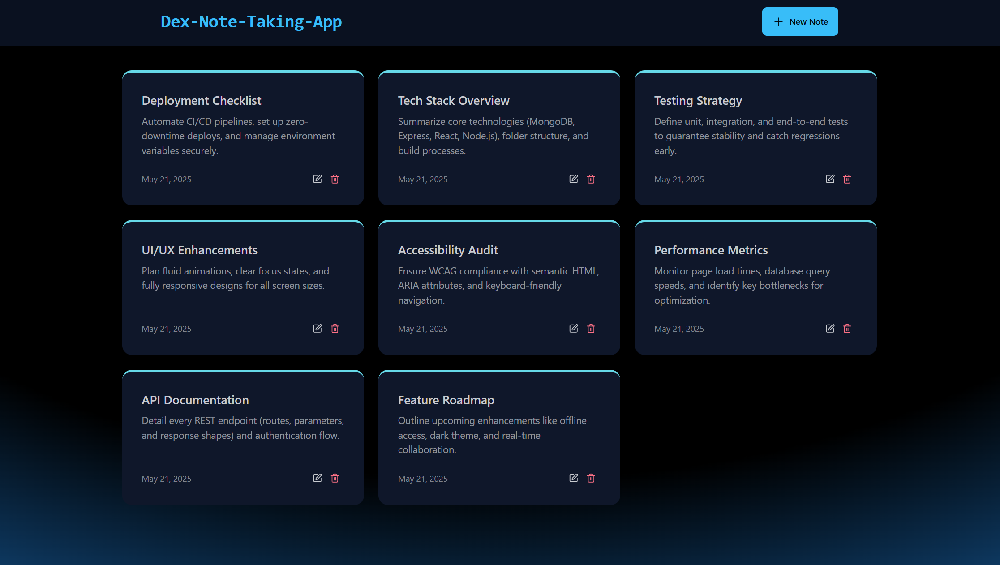

<div align="center">
  <br />
    <a href="https://dex-note-taking-app.vercel.app/" target="_blank">
      <kbd></kbd>
    </a>
  <br />

  <div>
    
    
    
    
  </div>

</div>

<div align="center">
   
    
    
    
    
    
    
    
    
</div>

  <h1 align="center">✍️ Dex-Note-Taking-App</h1>

This project, Dex-Note-Taking-App, is a hands-on, ground-up build I created to master the MERN stack (MongoDB, Express, React, Node) and hone modern full-stack development skills.

While I started this journey following the excellent tutorials of [burakorkmez (codesistency on YouTube)](https://www.youtube.com/@codesistency), I quickly delved off the beaten path to make this app truly mine. Through extensive experimentation, customizations, and iterative improvements, I've transformed the initial tutorial code into a personalized learning experience that reflects my growth as a developer. This is where the real learning happens when you take the foundation and build your own! 🙌

---

## 📑 Table of Contents

- ✨ [Project Highlights](#project-highlight)
- 🫚 [package.json (Root)](#packagejson-root)
- 📁 [package.json (Backend)](#packagejson-backend)
- 💻 [package.json (Frontend)](#packagejson-frontend)
- 🚀 [Getting Started](#getting-started)
- 📚 [Documentation](#documentation)
- 🚢 [Deployment](#deployment)
- 👨‍💻 [About Me](#about-me)
- 🙏 [Acknowledgments](#acknowledgments)
- 📌 [Note](#note)

---

## <a name="project-highlight">✨ Project Highlights</a>

- **`Full-Stack MERN App`**: MongoDB, Express.js, React, Node.js
- **`CRUD Notes`**: Create, read, update, and delete notes with title & description
- **`REST API`**: Fully functional backend endpoints using Express & Mongoose
- **`Rate Limiting`**: Upstash Redis protection from abuse real-world concept
- **`Mobile-First Responsive UI`**: Tailwind CSS, DaisyUI & Lucide icons optimized for all screen sizes
- **`Enhanced UX`**: Improved mobile experience with adaptive layouts and touch-friendly interactions
- **`Comprehensive Documentation`**: Extensive JSDoc comments with mentoring tone explaining the "why" behind code decisions
- **`Production-Ready Code`**: Well-documented, maintainable codebase with context-aware documentation
- **`Beginner Friendly`**: Clean code, clear structure, plenty of learning opportunities
- **`Tested API`**: Try endpoints with Postman or your favorite REST client
- **`Deployment Ready`**: Multiple deployment options with detailed guides

---

## <a name="packagejson-root">🫚 Root `package.json`</a>

```json
{
  "name": "dex-note-taking-app",
  "version": "1.0.0",
  "main": "index.js",
  "scripts": {
    "build": "npm install --prefix backend && npm install --prefix frontend && npm run build --prefix frontend",
    "start": "npm run start --prefix backend"
  },
  "keywords": [],
  "author": "",
  "private": true,
  "license": "SEE LICENSE IN LICENSE.md",
  "description": ""
}
```

---

## <a name="packagejson-backend">📁 Backend `package.json`</a>

```json
{
  "name": "backend",
  "version": "1.0.0",
  "main": "src/server.js",
  "scripts": {
    "dev": "nodemon src/server.js",
    "start": "node src/server.js"
  },
  "type": "module",
  "keywords": [],
  "author": "",
  "private": true,
  "license": "SEE LICENSE IN LICENSE.md",
  "description": "",
  "dependencies": {
    "@upstash/ratelimit": "^2.0.5",
    "@upstash/redis": "^1.34.9",
    "cors": "^2.8.5",
    "dotenv": "^16.5.0",
    "express": "^4.18.2",
    "mongoose": "^8.14.3"
  },
  "devDependencies": {
    "nodemon": "^3.1.10"
  }
}
```

---

## <a name="packagejson-frontend">💻 Frontend `package.json`</a>

```json
{
  "name": "frontend",
  "private": true,
  "version": "0.0.0",
  "type": "module",
  "scripts": {
    "dev": "vite",
    "build": "vite build",
    "lint": "eslint .",
    "preview": "vite preview"
  },
  "dependencies": {
    "axios": "^1.9.0",
    "lucide-react": "^0.510.0",
    "react": "^19.1.0",
    "react-dom": "^19.1.0",
    "react-hot-toast": "^2.5.2",
    "react-router": "^7.6.0"
  },
  "devDependencies": {
    "@eslint/js": "^9.25.0",
    "@types/react": "^19.1.2",
    "@types/react-dom": "^19.1.2",
    "@vitejs/plugin-react": "^4.4.1",
    "autoprefixer": "^10.4.21",
    "daisyui": "^4.12.24",
    "eslint": "^9.25.0",
    "eslint-plugin-react-hooks": "^5.2.0",
    "eslint-plugin-react-refresh": "^0.4.19",
    "globals": "^16.0.0",
    "postcss": "^8.5.3",
    "tailwindcss": "^3.4.17",
    "vite": "^6.3.5"
  }
}
```

---

## <a name="getting-started">🚀 Getting Started</a>

### 1. Prerequisites

- **Node.js** (v14 or higher)
- **npm** (comes with Node)
- A **MongoDB** connection URI (e.g. Atlas)
- An **Upstash Redis** REST URL & token

### 2. Configure environment variables

Create a `.env` file inside the `backend/` folder with the following:

```env
MONGO_URI=<your_mongo_uri>
PORT=8080

UPSTASH_REDIS_REST_URL=<your_redis_rest_url>
UPSTASH_REDIS_REST_TOKEN=<your_redis_rest_token>

NODE_ENV=development
```

### 3. Install & start the backend

```bash
cd backend
npm install
npm run dev
```

By default, the Express server will run on http://localhost:8080.

### 4. Start the Frontend

```bash
cd frontend
npm install
npm run dev
```

The React app will be served at http://localhost:5173 and proxy API requests to your backend.

### 5. Open the app

Navigate to http://localhost:5173 in your browser.
You can now create, edit, and delete notes via the UI!

---

## <a name="documentation">📚 Documentation</a>

### 📖 Code Documentation

This project features **comprehensive JSDoc comments** throughout the entire codebase, providing:

- **`Mentoring Tone`**: Comments written as if mentoring a junior developer, explaining the "why" behind code decisions
- **`Context-Aware Documentation`**: Comments that reference actual usage patterns and cross-component relationships
- **`Production-Ready Standards`**: Professional-grade documentation suitable for team collaboration
- **`Educational Value`**: Detailed explanations of architectural decisions, design patterns, and best practices
- **`Cross-Referenced`**: Links between related components, backend services, and configuration files

### 📋 Project Documentation

- 🛠️ [Architecture Overview](./architecture.md)
- 🔄 [User Flow Diagram](./flowchart.md)
- 🚀 [Deployment Guide](./DEPLOYMENT_GUIDE.md)

---

## <a name="deployment">🚢 Deployment</a>

This app can be deployed using multiple platforms. I've prepared a **complete and comprehensive deployment guide** for **Vercel + Fly.io** (free tier alternative to Render).

### 🆓 Free Tier Deployment (Recommended)

- **Frontend**: Vercel (React + Vite)
- **Backend**: Fly.io (Express API)
- **Database**: MongoDB Atlas
- **Rate Limiting**: Upstash Redis

📖 **[View Complete Deployment Guide →](./DEPLOYMENT_GUIDE.md)**

**What's included in the guide:**

- ✅ Step-by-step configuration file creation (`fly.toml`, `Dockerfile`, `vercel.json`)
- ✅ Environment variable setup and secrets management
- ✅ API endpoint testing and verification
- ✅ Troubleshooting common deployment issues
- ✅ Machine restart procedures for Fly.io
- ✅ Complete beginner-friendly explanations

### 🚀 Alternative: Render.com

The entire app can also be hosted on Render.com as two coordinated services **`Backend (Express API)`**, and **`Frontend (React + Vite)`**. Whenever you push to your main branch, Render will automatically rebuild and redeploy both services.

---

## <a name="about-me">👨‍💻 About Me</a>

Hi there! I'm **Dayle Cortes**, an American remote Full-Stack Software Engineer based in Florida.

- 🔭 I'm currently deepening my expertise in Full-Stack Development **PERN**, **MERN**, and **Next.js**
- 🌱 I love learning by doing coding-along with top instructors, then putting my own spin on projects to master every layer from database schema to production deployment.
- 📚 I'm passionate about code documentation and believe that well-documented code is the foundation of maintainable software
- 💼 Outside of coding, I love to cook and workout.
- ⚡ Fun fact: I'm always trying to become a better version of myself than I was yesterday. Constantly learning with a growth mindset.

---

## <a name="acknowledgments">🙏 Acknowledgments</a>

Thanks again to **burakorkmez (codesistency)** for the detailed video tutorials, clear guidance, and in-depth walkthroughs on this MERN Stack Project.

---

## <a name="note">📌 Note</a>

This app started as a learning project following @codesistency's excellent YouTube tutorial, but quickly evolved into something uniquely mine. Through countless hours of experimentation, customization, and iterative improvements, I've transformed the initial tutorial code into a personalized showcase of my growth as a developer. The real magic happens when you take the foundation and build something that reflects your own vision and learning journey.

The project was developed entirely in my local IDE (outside of GitHub) without initializing git, and I've reconstructed the commit history solely to reflect a realistic development flow and demonstrate my understanding of fullstack architecture and recent modifications, not as a record of the actual chronological build.

---
