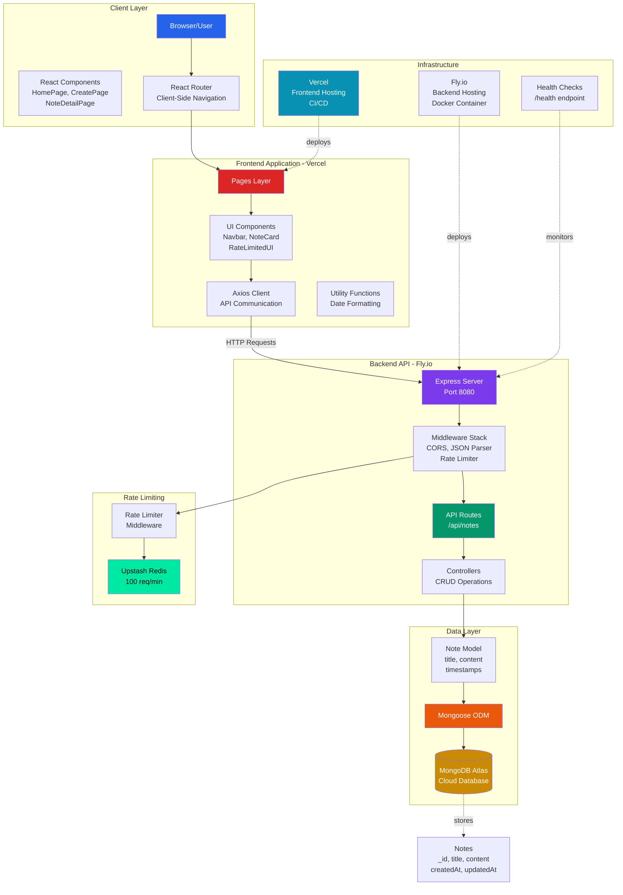

# ✍️ Dex-Note-Taking-App Architecture

## Modern MERN Stack with Production-Ready Features

Dex-Note-Taking-App is built from the ground up with production-level patterns, comprehensive documentation, and a focus on developer experience. The system leverages the MERN stack (MongoDB, Express, React, Node.js) with modern tooling and deployment strategies, demonstrating full-stack proficiency and attention to detail.

---

## 📑 Table of Contents

- 🔑 [Key Principles](#key-principles)
- 🌿 [System Overview](#system-overview)
- 🚀 [Deployment, Security, and Maintainability](#deployment-security-maintainability)
- 🤔 [Why This Architecture?](#why-this-architecture)

---

### 🔑 Key Principles

| Principles                               | Purpose                                                                                                                      |
| ---------------------------------------- | ---------------------------------------------------------------------------------------------------------------------------- |
| **Separation of Concerns**               | Clean separation between routes, controllers, models, and business logic for maintainability and clarity                     |
| **RESTful API Design**                   | Fully RESTful backend API with consistent endpoint structure, proper HTTP methods, and status codes                          |
| **Rate Limiting & Security**             | Upstash Redis-powered distributed rate limiting protects against abuse while maintaining user experience                     |
| **Comprehensive Documentation**          | JSDoc comments throughout the entire codebase with mentoring tone, explaining the "why" behind architectural decisions       |
| **Mobile-First Responsive Design**       | React components built with Tailwind CSS and DaisyUI, optimized for all screen sizes with touch-friendly interactions        |
| **Production-Ready Deployment Strategy** | Separate deployment of frontend (Vercel) and backend (Fly.io) with environment-specific configurations and health monitoring |

---

### 🌿 System Overview

**Additional Infrastructure:**

- **Vercel (CI/CD)**: Automatically builds and deploys frontend on git push with preview environments
- **Fly.io (Container Hosting)**: Dockerized backend with auto-scaling and health monitoring
- **Environment Variables**: Securely managed secrets for database connections and API keys
- **CORS Configuration**: Environment-specific origin whitelisting for secure cross-origin requests

---

- **Frontend**: Built with React 19 and Vite for blazing-fast development and optimized production builds. Uses React Router for client-side navigation and Axios for API communication. The UI follows a mobile-first approach with Tailwind CSS and DaisyUI components.

- **Styling**: Tailwind CSS with DaisyUI theme system enables rapid prototyping and consistent design. Custom radial gradient backgrounds and responsive breakpoints create a polished, modern aesthetic across all devices.

- **Backend/API**: Express.js REST API following controller-service pattern with clean separation of concerns. Organized by domain (notes) with dedicated routes, controllers, and models. Health check endpoint enables deployment platform monitoring.

- **Rate Limiting & Security**: Upstash Redis-powered sliding window rate limiter (100 requests/60s) protects against abuse. Global middleware applied to all routes with graceful user feedback. Environment-specific CORS whitelisting ensures secure cross-origin communication.

- **Database / ORM**: MongoDB Atlas with Mongoose ODM provides flexible schema design and powerful query capabilities. Note model includes automatic timestamps and schema validation. Connection pooling and error handling ensure reliability.

- **State Management**: React's built-in useState and useEffect hooks provide simple, effective state management. Forms use controlled components for real-time validation. Parent-child component communication through props enables immediate UI updates.

- **Error Handling**: Comprehensive error handling across all layers with user-friendly toast notifications. Specific handling for rate limiting (429 status) with custom UI component. Network errors and validation failures provide clear feedback.

- **Documentation**: Production-grade JSDoc comments throughout entire codebase with mentoring tone. Context-aware documentation explains architectural decisions, cross-component relationships, and real-world usage patterns.

---

### 🚀 Deployment, Security, and Maintainability

- **CI/CD**: Frontend automatically deploys through Vercel on git push with instant rollbacks. Backend deploys to Fly.io via Docker with health monitoring. Both platforms provide preview environments for testing.

- **Code Quality**: Comprehensive JSDoc documentation with professional standards. ESLint enforces code consistency. Extensive inline comments explain complex logic and architectural decisions.

- **Secrets & Config**: All sensitive credentials managed through environment variables following 12-factor app methodology. Different configurations for development and production. Secrets encrypted at rest in deployment platforms.

- **Performance**: Vite enables fast development with HMR and optimized production builds. React's virtual DOM ensures efficient updates. MongoDB indexes on note IDs provide fast lookups. Rate limiting prevents resource exhaustion.

- **Monitoring**: Fly.io health checks monitor backend availability. Custom /health endpoint provides application status. Logs accessible through platform CLIs for debugging and monitoring.

- **Security**: CORS configuration prevents unauthorized cross-origin requests. Rate limiting protects against abuse. Input validation on both client and server. MongoDB injection protection through Mongoose ODM.

---

## 🤔 Why This Architecture?

This is a thoughtfully designed, production-ready application that demonstrates mastery of the full MERN stack. Every architectural decision was made with consideration for scalability, maintainability, and user experience.

I understand the architecture end-to-end, and chose each tool or technique specifically for:

- **Developer Experience**: Vite for fast development, comprehensive JSDoc for onboarding, clear project structure
- **User Experience**: Mobile-first responsive design, toast notifications for feedback, loading states for async operations
- **Scalability**: Separate frontend/backend deployment, distributed rate limiting, auto-scaling capabilities
- **Security**: Rate limiting, CORS configuration, environment-based secrets, input validation
- **Maintainability**: Clean code structure, comprehensive documentation, TypeScript-style JSDoc, modular components
- **Cost Efficiency**: Free-tier compatible with Vercel, Fly.io, MongoDB Atlas, and Upstash Redis

---

For micro-level user-flow, please refer to [flowchart.md](./flowchart.md).

---
