# 🗺️ Feature/User Flowchart

## Micro-level: Complete Note Management Journey

This document visualizes the **step-by-step flow** of a user's journey in the Dex-Note-Taking-App.  
It represents how users interact with the application from landing to creating, viewing, editing, and deleting notes, demonstrating the complete CRUD workflow and helping developers/designers optimize for each interaction.

---

### 🔄 User Interaction Flow

```mermaid
graph TD
    A[User Visits App /] --> B[HomePage Loads]
    B --> C{API Status?}

    C -->|Loading| D[Loading Spinner]
    C -->|Rate Limited 429| E[RateLimitedUI Component]
    C -->|Success| F{Notes Exist?}

    F -->|No Notes| G[NotesNotFound Component]
    F -->|Notes Exist| H[Notes Grid Display]

    H --> I{User Action?}
    G --> I

    I -->|Click New Note| J[Navigate to /create]
    I -->|Click Note Card| K[Navigate to /note/:id]
    I -->|Click Delete on Card| L[Confirm Delete Dialog]

    J --> M[CreatePage Form]
    M --> N[Fill Title & Content]
    N --> O{Form Valid?}

    O -->|No| P[Show Validation Error]
    P --> N
    O -->|Yes| Q[Submit to API POST /notes]

    Q --> R{API Response?}
    R -->|Rate Limited 429| S[Toast: Slow down! 💀]
    R -->|Error| T[Toast: Failed to create]
    R -->|Success 201| U[Toast: Note created!]

    S --> M
    T --> M
    U --> V[Navigate to HomePage /]

    K --> W[NoteDetailPage Loads]
    W --> X[GET /notes/:id]
    X --> Y{Note Found?}

    Y -->|Not Found| Z[Toast: Failed to fetch]
    Y -->|Found 200| AA[Display Edit Form]

    AA --> AB{User Action?}

    AB -->|Edit Title/Content| AC[Update Form State]
    AB -->|Click Save| AD{Form Valid?}
    AB -->|Click Delete| AE[Confirm Delete Dialog]
    AB -->|Click Back| V

    AC --> AA

    AD -->|No| AF[Toast: Add title/content]
    AD -->|Yes| AG[Submit to API PUT /notes/:id]

    AF --> AA

    AG --> AH{API Response?}
    AH -->|Error| AI[Toast: Failed to update]
    AH -->|Success 200| AJ[Toast: Note updated!]

    AI --> AA
    AJ --> V

    L --> AK{Confirm?}
    AE --> AK

    AK -->|Cancel| AL[Return to Current Page]
    AK -->|Confirm| AM[DELETE /notes/:id]

    AM --> AN{API Response?}
    AN -->|Error| AO[Toast: Failed to delete]
    AN -->|Success 200| AP[Toast: Note deleted!]

    AO --> AL
    AP --> V

    E --> AQ[Display Rate Limit Message]
    AQ --> AR[Wait for Rate Limit Reset]
    AR --> B

    V --> B

    style A fill:#2563eb,color:#ffffff
    style B fill:#059669,color:#ffffff
    style J fill:#ca8a04,color:#ffffff
    style K fill:#7c3aed,color:#ffffff
    style M fill:#dc2626,color:#ffffff
    style W fill:#ea580c,color:#ffffff
```

---

### 📝 Flow Steps (Text Summary)

- **User Visits App** (`/`)
- -> **HomePage** loads and fetches notes via GET `/api/notes`
  - **Loading State**: Shows loading spinner with "Loading notes..." message
  - **Rate Limited** (429): Shows RateLimitedUI component with warning message
  - **No Notes**: Shows NotesNotFound component with call-to-action
  - **Success**: Displays notes in responsive grid layout (1/2/3 columns based on screen size)

#### Creating Notes

- From HomePage: Click **"New Note"** button in Navbar
- -> **CreatePage** (`/create`) displays creation form
  - Fill in **Title** and **Content** fields (controlled inputs)
  - **Form Validation**: Client-side check for empty fields
  - Submit form -> POST `/api/notes`
    - **Rate Limited** (429): Shows toast with emoji "Slow down! 💀" (4s duration)
    - **Error**: Shows toast "Failed to create note"
    - **Success** (201): Shows toast "Note created successfully!"
      - Automatically navigates back to HomePage
      - New note appears in grid immediately

#### Viewing and Editing Notes

- From HomePage: Click on any **Note Card**
- -> **NoteDetailPage** (`/note/:id`) loads specific note

  - Fetches note data via GET `/api/notes/:id`
  - **Loading State**: Shows centered loading spinner
  - **Not Found**: Shows error toast
  - **Success**: Displays editable form with note data

  - **Edit Actions**:

    - Modify **Title** or **Content** (real-time state updates)
    - Click **"Save Changes"** button
      - **Validation**: Client-side check for empty fields
      - Submit via PUT `/api/notes/:id`
      - **Error**: Shows toast "Failed to update note"
      - **Success**: Shows toast "Note updated successfully!"
        - Navigates back to HomePage with updated data

  - **Navigation**:
    - Click **"Back to Notes"** -> Returns to HomePage

#### Deleting Notes

- **Option 1**: From HomePage

  - Click **Delete Icon** (Trash) on Note Card
    - **Confirmation Dialog**: "Are you sure you want to delete this note?"
    - **Cancel**: Returns to notes grid
    - **Confirm**: Sends DELETE `/api/notes/:id`
      - **Success**: Note removed from grid immediately
      - Shows toast "Note deleted successfully"

- **Option 2**: From NoteDetailPage
  - Click **"Delete Note"** button (top right)
    - **Confirmation Dialog**: Same confirmation flow
    - **Success**: Navigates back to HomePage
    - Shows toast "Note deleted"

#### Rate Limiting Handling

- **HomePage**: Shows RateLimitedUI component when 429 response detected
- **CreatePage**: Shows custom toast with skull emoji (💀) and 4-second duration
- **Rate Limit**: 100 requests per 60-second sliding window (managed by Upstash Redis)
- **User Feedback**: Clear messaging about rate limits with instructions to wait

---

### 🎯 Component Responsibilities

| Component          | Purpose                                                                                |
| ------------------ | -------------------------------------------------------------------------------------- |
| **HomePage**       | Main landing page, fetches and displays all notes in grid, handles rate limiting state |
| **CreatePage**     | Form for creating new notes with validation and API integration                        |
| **NoteDetailPage** | View, edit, and delete individual notes with full CRUD operations                      |
| **Navbar**         | Navigation header with app branding and "New Note" button                              |
| **NoteCard**       | Individual note preview card with edit navigation and delete action                    |
| **RateLimitedUI**  | Warning component displayed when rate limit is exceeded                                |
| **NotesNotFound**  | Empty state component when no notes exist with call-to-action                          |

---

### 🔄 State Management Pattern

- **Parent State**: HomePage maintains the notes array as source of truth
- **Prop Drilling**: setNotes function passed to NoteCard for real-time updates
- **Local State**: Each page manages its own loading, form data, and error states
- **Navigation**: React Router's navigate function handles programmatic navigation
- **API Client**: Axios instance with environment-aware base URL configuration

---

## 💡 Why This Flowchart?

This flowchart provides developers and stakeholders with an "at-a-glance" reference of how users navigate through the app. It supports:

- **Feature Planning**: Understanding complete user journeys for new features
- **Testing Strategy**: Identifying critical paths and edge cases
- **Error Handling**: Documenting error states and user feedback mechanisms
- **Onboarding**: Helping new developers understand application flow
- **UX Optimization**: Identifying opportunities to improve user experience

For high-level system architecture, please refer to [architecture.md](./architecture.md).

---
